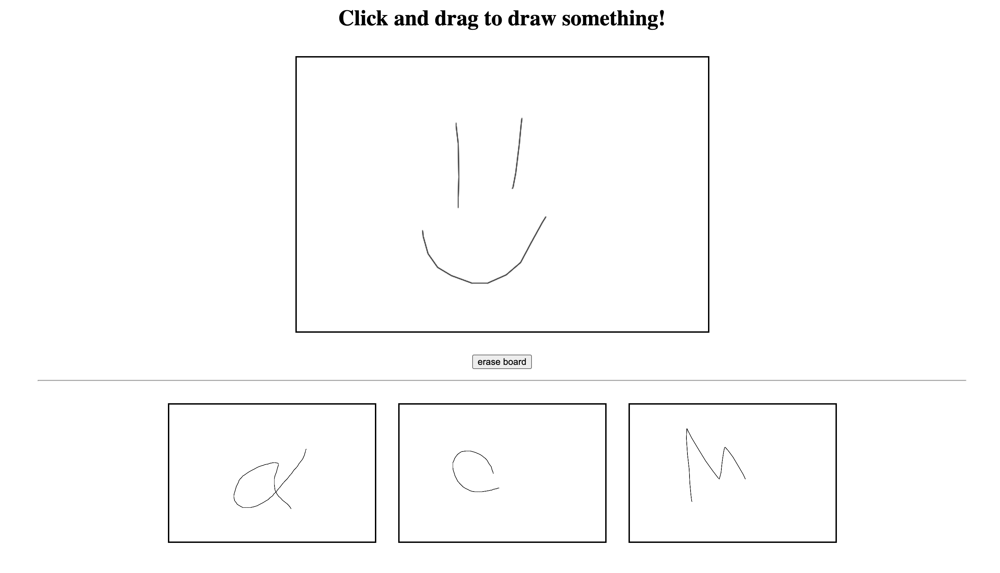

# next-firebase-canvas

Code Next Workshop based around HTML5 canvas + Google Firebase

- [Demo Starting Code](https://mpaulweeks.github.io/next-firebase-canvas/next-firebase-canvas)
- [Demo Solution](https://mpaulweeks.github.io/next-firebase-canvas/solution/)
- [Download Starting Code (zip)](https://mpaulweeks.github.io/next-firebase-canvas/next-firebase-canvas.zip)
- [Guide to Firebase Setup](https://mpaulweeks.github.io/next-firebase-canvas/guide)

  

