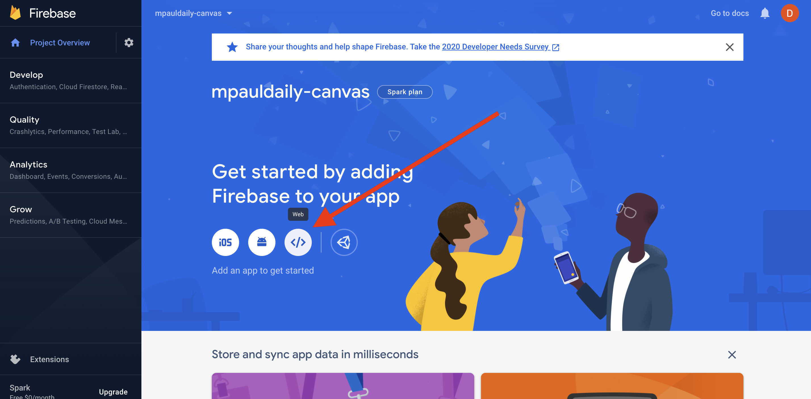
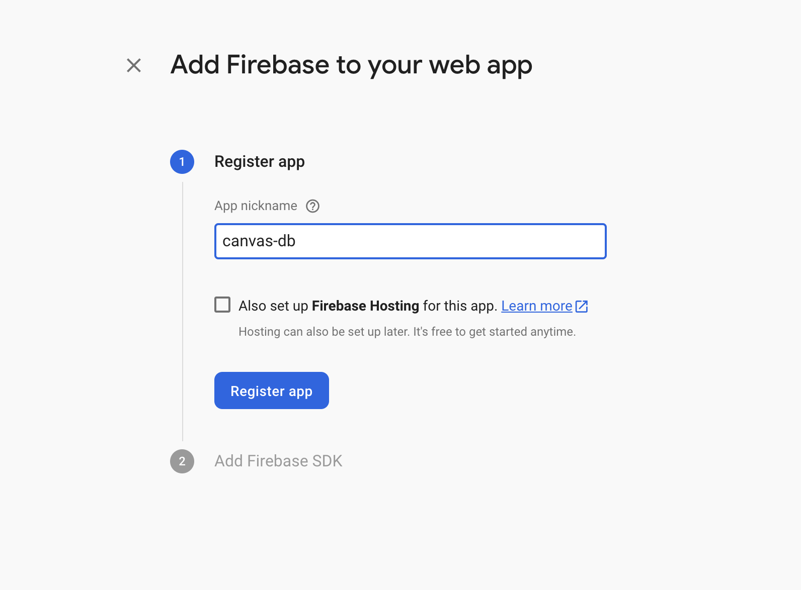
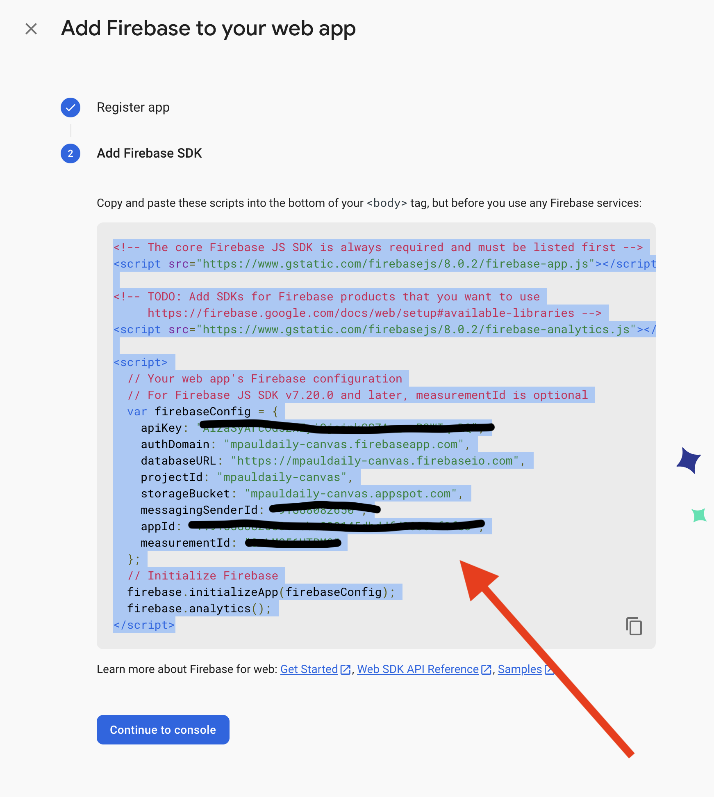
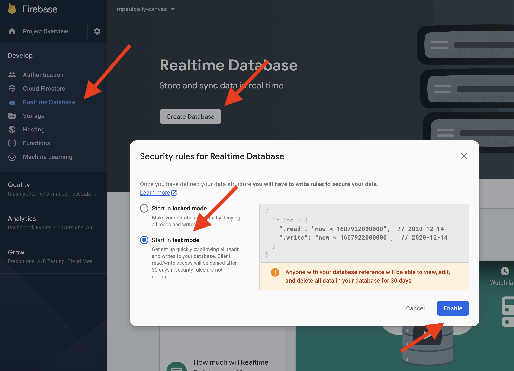

# Seting up Firebase

- Entry point: https://console.firebase.google.com/
- Pick any name for your project
- OK the analytics
- OK the terms
- Wait for project...

## Create firebase webapp to get access code

- Click `<>` to setup for web, say NO to hosting

- The name here doesn't matter. Make it different from your firebase name just to avoid confusion.

- Copy the entire blurb into your code! `index.html`, right above the script tags
- Still in your code, copy/paste analytics import and replace `firebase-analytics` with `firebase-database`

## Create firebase realtime database for storing our data

- Use right bar to select Realtime Database
- Click `Create Database` button
- Start in `test mode` and then enable!
